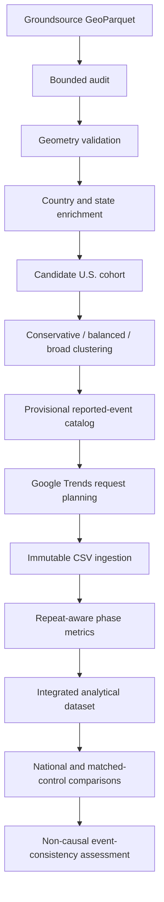

# GeoDemand-FF

GeoDemand-FF is a reproducible geospatial event-study pipeline for constructing
candidate U.S. flood episodes from reported flood footprints and evaluating
state-level search-interest responses before and after those episodes.

The project is intentionally scoped to reported flood footprints and Google Trends
event-study analysis. It does not claim confirmed events, causal attribution, or
predictive demand forecasting.

## Active Pipeline



## Install

```bash
uv sync
uv run geodemand --help
```

For the controlled browser export assistant:

```bash
uv sync --extra trends-browser
```

## Development

```bash
python -m ruff check .
python -m ruff format --check .
python -m mypy
python scripts/run_tests.py
python scripts/validate_documented_cli.py
```

## First Data Audit

```bash
geodemand data inspect-groundsource --input PATH
geodemand data audit-groundsource --input PATH --output-dir PATH
geodemand data validate-groundsource --input PATH
```

Country filtering requires an explicit boundary dataset:

```bash
geodemand data filter-groundsource --input PATH --output PATH --country US --country-boundaries PATH
```

## Candidate Episode Workflow

```bash
geodemand boundaries prepare --boundary-root PATH --output-dir PATH
geodemand data enrich-spatial --input PATH --countries PATH --states PATH --output-dir PATH
geodemand cohort build --events PATH --state-overlaps PATH --output-dir PATH
geodemand episodes build --events PATH --event-states PATH --output-dir PATH --policy conservative
geodemand episodes compare --events PATH --event-states PATH --output-dir PATH
geodemand catalog build-provisional --cohort-root PATH --episode-root PATH --comparison-root PATH --rules config/catalog_rules.yaml --output-dir PATH
```

## Google Trends Workflow

```bash
geodemand trends pilot-sample --catalog-dir PATH --output-root PATH --rules config/trends_rules.yaml
geodemand trends map-geographies --pilot PATH --output-root PATH
geodemand trends plan --pilot PATH --geography PATH --terms config/trends_terms.yaml --rules config/trends_rules.yaml --output-root PATH --include-national
geodemand trends import-csv --csv PATH --sidecar PATH --output-root PATH
geodemand trends validate-imports --observations PATH --plan PATH
geodemand trends metrics --observations PATH --plan PATH --rules config/trends_rules.yaml --output-root PATH
geodemand trends phase-metrics --observations PATH --plan PATH --terms config/trends_terms.yaml --rules config/trends_rules.yaml --output-root PATH
geodemand trends concurrence --observations PATH --plan PATH --terms config/trends_terms.yaml --rules config/trends_rules.yaml --output-root PATH
geodemand trends attribute-peaks --phase-metrics PATH --concurrence PATH --rules config/trends_rules.yaml --output-root PATH
geodemand analysis build-dataset --request-plan PATH --episode-metrics PATH --repeat-metrics PATH --phase-metrics PATH --output-root PATH
```

The Trends workflow preserves immutable raw CSVs, request sidecars, repeat lineage,
repeat-aware concurrence consensus, national diagnostics, and matched-control
comparisons. Trends values are request-relative indices; the project avoids raw
0-to-100 cross-geography subtraction.

Run `trends metrics` and `trends phase-metrics` before `analysis build-dataset`; their
episode, repeat, and phase tables are separate inputs to the integration command. The
analysis dataset uses the explicit analytical row grain `request_id + repeat_id +
concept_id`. It accepts CSV, Parquet, or `.pq` request plans, rejects empty or duplicate
normalized keys, validates planned concepts and joined lineage, preserves long request
IDs, and writes
`analysis_dataset.parquet`, `join_summary.json`, `unmatched_keys.csv`, and
`provenance.json` under the selected output root. It is an integration artifact, not a
statistical-validation result. Missing plan coverage is reported once per absent
`request_id + repeat_id + concept_id`; request-level fallback plans apply every planned
concept to every repeat observed for that request. Phase and integrated Parquet artifacts
retain explicit typed schemas even when they contain zero rows.

## Synthetic Demo

```bash
python scripts/synthetic_demo.py --output-dir demo-output
```

The demo uses synthetic Groundsource-like records and synthetic Google Trends
observations. Repeated runs in the same locked execution environment produce
identical scientific artifacts and manifests.

## Data Policy

Do not commit downloaded research data, raw Google Trends exports, generated full-size
audit outputs, canonical Parquet outputs, quarantine outputs, or rejected-record
outputs. See `DATA_LICENSES.md` for active dataset notes.

## Roadmap

Future work may evaluate precipitation coherence using NOAA MRMS or another
independent meteorological dataset.
