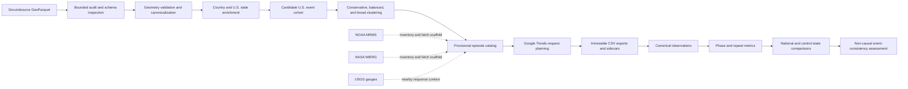

# GeoDemand-FF


**GeoDemand-FF** is a reproducible geospatial event-study pipeline for constructing candidate U.S. flood episodes and measuring state-level changes in public search interest around them.

The project combines large-scale geospatial data engineering, deterministic event clustering, physical-evidence provenance, hydrologic context, and Google Trends analysis. Its current purpose is to support transparent research into whether flood-related events are followed or preceded by detectable changes in information seeking, emergency preparation, disruption, cleanup, insurance, and recovery behavior.

> **Project status:** Pre-alpha research software.
> GeoDemand-FF does not yet provide confirmed flood ground truth, causal attribution, or predictive demand forecasting.

---

## Table of Contents

* [Research Motivation](#research-motivation)
* [Research Questions](#research-questions)
* [What the Project Does](#what-the-project-does)
* [What the Project Does Not Claim](#what-the-project-does-not-claim)
* [Verified Results](#verified-results)
* [System Architecture](#system-architecture)
* [Pipeline Components](#pipeline-components)
* [Google Trends Event-Study Design](#google-trends-event-study-design)
* [Installation](#installation)
* [Five-Minute Synthetic Demonstration](#five-minute-synthetic-demonstration)
* [Core Command-Line Workflow](#core-command-line-workflow)
* [Outputs and Data Lineage](#outputs-and-data-lineage)
* [Repository Structure](#repository-structure)
* [Reproducibility and Scientific Safeguards](#reproducibility-and-scientific-safeguards)
* [Testing and Continuous Integration](#testing-and-continuous-integration)
* [Scientific Limitations](#scientific-limitations)
* [Roadmap](#roadmap)
* [Documentation](#documentation)
* [Citation](#citation)
* [License](#license)

---

## Research Motivation

Flood-related information is fragmented across event reports, precipitation products, stream gauges, forecasts, media coverage, and public behavior.

A news-derived flood footprint may describe:

* One physical event
* Several reports of the same event
* Overlapping but distinct events
* A broad regional impact
* A location with limited physical verification
* A report that does not correspond cleanly to a hydrologic episode

Search-interest data introduce a different challenge. A rise in a term such as `weather`, `Walmart`, `insurance`, or `outage` may occur around a flood, but it may also reflect heat, promotions, holidays, unrelated storms, or national events.

GeoDemand-FF therefore separates the research problem into three stages:

1. Construct reproducible candidate flood episodes.
2. Attach transparent physical and contextual evidence.
3. Evaluate whether search-interest responses are temporally and geographically consistent with those episodes.

The project deliberately avoids treating temporal coincidence as proof of causation.

---

## Research Questions

GeoDemand-FF is designed around the following questions:

1. Can a large global flood-footprint archive support a reproducible U.S. candidate-event cohort?
2. How sensitive are candidate episodes to temporal and spatial clustering assumptions?
3. Can precipitation and nearby-gauge observations strengthen episode review without being treated as perfect ground truth?
4. Do state-level search-interest series show stable responses before, during, or after candidate flood episodes?
5. Can national trends, matched control states, and nonflood context terms help distinguish event-consistent signals from unrelated peaks?
6. Which search concepts are sufficiently available, stable, and interpretable for later modeling?

---

## What the Project Does

GeoDemand-FF currently provides:

* Bounded auditing of multimillion-row GeoParquet datasets
* Geometry validation and canonicalization
* Country and U.S. state spatial enrichment
* Candidate-event cohort construction
* Deterministic episode clustering under multiple policies
* Episode-membership and split-leakage validation
* Provisional catalog construction
* Mandatory provenance validation for physical evidence
* NOAA MRMS inventory and bounded-fetch scaffolding
* NASA IMERG inventory and bounded-fetch scaffolding
* USGS nearby-gauge discovery and response assessment
* Google Trends request planning
* Immutable manual CSV ingestion
* Experimental supervised browser export assistance
* Repeat-aware search-interest phase metrics
* Event-concurrence diagnostics
* National and control-state comparison scaffolding
* Non-causal peak-attribution categories
* Deterministic synthetic demonstrations
* Offline unit and integration tests

---

## What the Project Does Not Claim

GeoDemand-FF does **not** currently claim to provide:

* Confirmed flood ground truth
* A complete national flood-event database
* Universal urban flash-flood classification
* Causal estimates of flood-driven consumer behavior
* Absolute Google search counts
* Proof that searches occurred inside an event polygon
* Hydrologic connectivity based only on gauge proximity
* Completed real MRMS episode extraction
* Completed real IMERG episode extraction
* A trained demand-forecasting model
* Production operational readiness

Candidate events and episodes remain research units requiring physical validation and sensitivity analysis.

---

## Verified Results

The following results were produced from the locally audited Groundsource dataset and are not bundled with the repository.

| Result                                             |               Verified value |
| -------------------------------------------------- | ---------------------------: |
| Groundsource source records audited                |                    2,646,302 |
| Valid source geometries                            |                    2,646,302 |
| Invalid source geometries                          |                            0 |
| Antimeridian review flags                          |                          300 |
| Eligible primary U.S. candidate records, 2022–2025 |                       88,515 |
| Conservative candidate episodes                    |                       37,053 |
| Duplicate episode memberships                      |                            0 |
| Cross-split membership leakage                     |                            0 |
| Latest offline test result                         | 151 passed, 2 opt-in skipped |

The full Groundsource audit found:

* Balanced terminal row accounting
* No quarantined records
* No rejected records
* No duplicate UUID groups
* No missing required geometry or date values
* Polygon and MultiPolygon geometries only

These results describe data quality and deterministic processing. They do not establish that every source record represents a distinct or physically confirmed flood.

---

## System Architecture



---

## Pipeline Components

### 1. Groundsource Audit

The Groundsource audit inspects GeoParquet metadata and processes records in bounded row groups and batches.

It evaluates:

* Required and optional fields
* Geometry decoding
* Geometry type
* Geometry validity
* Empty or null geometry
* Temporal coverage
* UUID duplication
* Row accounting
* Antimeridian review conditions

The pipeline does not assume latitude or longitude columns. Representative coordinates are derived from the supplied geometry and are not treated as source observations.

---

### 2. Spatial Enrichment

Natural Earth country boundaries and U.S. Census state boundaries are used to derive:

* Country membership
* U.S. intersection
* State overlap
* Primary state
* Multistate status
* U.S. overlap area
* Spatial-review flags
* Study-domain classification

Area calculations use an equal-area coordinate system where appropriate.

Cross-border, offshore, multistate, and review-required records are preserved rather than silently discarded.

---

### 3. Candidate Cohort

The candidate cohort selects records for a configured period and study domain.

The primary completed cohort uses:

* Dates: 2022-01-01 through 2025-12-31
* Primary domain: contiguous United States plus Washington, DC
* Secondary domains retained separately
* Explicit exclusion reasons
* Deterministic temporal splits

A candidate record is not treated as a confirmed flood event.

---

### 4. Episode Clustering

Three deterministic clustering policies are supported.

| Policy       | Temporal relationship | Spatial relationship                                     |
| ------------ | --------------------- | -------------------------------------------------------- |
| Conservative | Intervals overlap     | Geometries intersect                                     |
| Balanced     | Gap of at most 1 day  | Intersection, IoU threshold, or distance threshold       |
| Broad        | Gap of at most 2 days | More permissive intersection, IoU, or distance threshold |

Candidate pairs are generated through temporal and state-based indexing rather than unrestricted all-pairs comparison.

Episodes are connected components. Singleton episodes are valid.

Episode IDs are deterministic SHA-256 values derived from:

* Policy version
* Policy name
* Sorted member event IDs

The conservative policy is retained as the primary catalog unit. Balanced and broad policies are used for sensitivity and review evidence.

---

### 5. Provisional Episode Catalog

The provisional catalog preserves conservative episode membership and attaches:

* Balanced-policy relationship evidence
* Clustering diagnostics
* Review requirements
* Optional physical evidence
* Split and merge candidates
* Decision history
* Evidence availability
* Provenance status

Missing physical evidence is represented as pending or unknown, not automatically negative.

The catalog does not overwrite source cohort or clustering artifacts.

---

### 6. Physical and Hydrologic Evidence

#### NOAA MRMS

Implemented:

* Environment self-check
* Episode sampling
* Object inventory
* Download planning
* Bounded compressed-file retrieval
* Cache validation
* Manifest generation

Pending:

* Real decoded GRIB spatial extraction
* Episode precipitation metrics
* Coverage and coherence validation using observed files

The production MRMS extraction command intentionally fails with:

```text
real_mrms_extraction_not_implemented
```

It cannot emit synthetic scientific evidence.

#### NASA IMERG

Implemented:

* Earthdata environment self-check
* Granule inventory
* Bounded fetch planning
* Cache and manifest scaffolding
* Documented rate-to-accumulation requirements

Pending:

* Real HDF5 precipitation decoding
* Geometry-aware episode extraction
* Observed episode metrics

The production IMERG extraction command intentionally fails with:

```text
real_imerg_extraction_not_implemented
```

#### USGS

The USGS workflow supports:

* Nearby gauge discovery
* Continuous discharge and gage-height retrieval
* Configured observation-coverage rules
* Parameter-specific response assessment
* Qualifier preservation
* Explicit association-quality categories
* Strongest-response gauge selection

Gauge evidence is proximity-based context. It does not prove that a monitoring location is downstream from or hydrologically connected to an event footprint.

---

## Google Trends Event-Study Design

Google Trends values are normalized within each request on a relative 0–100 scale. They are not absolute search counts.

GeoDemand-FF therefore preserves the complete request context:

* Query terms and ordering
* Geography
* Date range
* Category
* Search property
* Request role
* Episode ID
* Terminology version
* Repeat ID
* Export attempt ID
* Source CSV checksum
* Sidecar metadata

### Standard Response Phases

The event-study rules define separate response periods:

| Phase             | Definition                                                 |
| ----------------- | ---------------------------------------------------------- |
| Anticipatory      | 7 days before the episode through the day before it begins |
| Immediate         | Episode start through 2 days after episode end             |
| Early recovery    | Days 3–7 after episode end                                 |
| Extended recovery | Days 8–28 after episode end                                |

Pre-event peaks are retained because preparation behavior may occur before reported flood impacts.

### Search-Concept Families

The versioned terminology dictionary includes:

* Flood awareness
* Weather context
* Immediate response
* Damage and cleanup
* Assistance and recovery
* Service disruption
* Retailer attention
* Preparation products
* Damage-mitigation products
* Diagnostic nonflood weather terms

Examples include:

```text
weather
flood
flooding
flash flood
heavy rain
outage
road closed
school closed
FEMA
insurance
cleanup
Walmart
Home Depot
generator
bottled water
sandbags
sump pump
dehumidifier
```

Broad or branded terms are treated as ambiguous behavioral proxies, not direct evidence of flood demand.

For example:

* A `weather` peak may reflect heat, snow, or another storm.
* A `Walmart` peak may reflect promotions or holidays.
* An `outage` peak may reflect electricity, internet, or service disruption.
* A `traffic` peak is not flood-specific.

### Comparison Design

Cross-geography comparisons never subtract raw independently normalized Trends indices.

The intended comparison sequence is:

1. Calculate within-series baseline-standardized phase lift.
2. Preserve metrics separately by request and repeat.
3. Evaluate repeat stability.
4. Aggregate only after variability is documented.
5. Compare treated-state lift with national or control-state standardized lift.

National and control-state comparisons remain observational and non-causal.

---

## Installation

### Requirements

* Python 3.11, 3.12, or 3.13
* Git
* [`uv`](https://docs.astral.sh/uv/) recommended

### Core Development Environment

From the repository root:

```bash
uv sync --extra dev
```

Verify the installation:

```bash
uv run geodemand --help
```

### Optional Dependencies

Install only the source-specific clients you need.

```bash
uv sync --extra mrms
uv sync --extra imerg
uv sync --extra usgs
uv sync --extra trends-browser
```

Install all physical-verification clients:

```bash
uv sync --extra verification
```

For the experimental browser export assistant:

```bash
uv sync --extra trends-browser
uv run playwright install chromium
```

The browser assistant uses visible, controlled browser automation. It does not implement CAPTCHA bypass, proxy rotation, fingerprint spoofing, credential capture, or anti-bot evasion.

Scientific workflows currently require the cloned repository and explicit configuration paths. The wheel is suitable for CLI inspection and development use but is not yet a standalone distribution containing all configuration and reference files.

---

## Five-Minute Synthetic Demonstration

The demonstration uses only clearly labeled synthetic fixtures.

It performs:

1. Candidate cohort creation
2. Conservative and balanced episode clustering
3. Episode-policy comparison
4. Provisional catalog construction
5. Synthetic Trends observation generation
6. Phase-metric calculation
7. Deterministic SVG plot generation
8. Manifest and checksum generation

Run:

```bash
uv run python scripts/synthetic_demo.py --output-dir demo-output
```

Expected high-level structure:

```text
demo-output/
├── candidate_cohort/
├── episode_policies/
├── episode_comparison/
├── provisional_catalog/
├── trends/
└── demo_manifest.json
```

Run the demonstration twice to verify deterministic scientific outputs:

```bash
uv run python scripts/synthetic_demo.py --output-dir demo-first
uv run python scripts/synthetic_demo.py --output-dir demo-second
```

Compare the manifests:

```bash
diff demo-first/demo_manifest.json demo-second/demo_manifest.json
```

On PowerShell:

```powershell
Compare-Object `
  (Get-Content demo-first\demo_manifest.json) `
  (Get-Content demo-second\demo_manifest.json)
```

No output indicates matching manifests.

---

## Core Command-Line Workflow

All research paths are explicit. Raw and generated full-size data should remain outside the repository.

### Groundsource Audit

```powershell
geodemand data inspect-groundsource `
  --input GROUND_SOURCE_PARQUET

geodemand data audit-groundsource `
  --input GROUND_SOURCE_PARQUET `
  --output-dir AUDIT_DIR

geodemand data validate-groundsource `
  --input GROUND_SOURCE_PARQUET
```

Use bounded options such as `--max-rows`, `--max-row-groups`, and `--batch-size` for smoke testing.

---

### Boundary Preparation and Spatial Enrichment

```powershell
geodemand boundaries prepare `
  --boundary-root BOUNDARY_ROOT `
  --output-dir PREPARED_BOUNDARIES

geodemand data enrich-spatial `
  --input GROUND_SOURCE_PARQUET `
  --countries COUNTRIES_PARQUET `
  --states STATES_PARQUET `
  --output-dir SPATIAL_OUTPUT
```

---

### Candidate Cohort and Episode Comparison

```powershell
geodemand cohort build `
  --events ENRICHED_EVENTS `
  --state-overlaps STATE_OVERLAPS `
  --output-dir COHORT_OUTPUT `
  --start-date 2022-01-01 `
  --end-date 2025-12-31

geodemand episodes compare `
  --events ELIGIBLE_EVENTS `
  --event-states EVENT_STATES `
  --output-dir EPISODE_COMPARISON
```

---

### Provisional Catalog

```powershell
geodemand catalog build-provisional `
  --cohort-root COHORT_ROOT `
  --episode-root EPISODE_ROOT `
  --comparison-root COMPARISON_ROOT `
  --rules config/catalog_rules.yaml `
  --output-dir CATALOG_OUTPUT

geodemand catalog validate `
  --catalog-dir CATALOG_OUTPUT
```

Optional physical evidence must identify itself as observed data using the supported provenance contract.

Synthetic fixtures, missing provenance, empty provenance, and unsupported physical-evidence schemas are rejected by production catalog construction.

---

### Google Trends Event Study

Calculate response-phase metrics:

```powershell
geodemand trends phase-metrics `
  --observations OBSERVATIONS `
  --plan REQUEST_PLAN `
  --terms config/trends_terms.yaml `
  --rules config/trends_rules.yaml `
  --output-root TRENDS_OUTPUT
```

Calculate event concurrence:

```powershell
geodemand trends concurrence `
  --observations OBSERVATIONS `
  --plan REQUEST_PLAN `
  --terms config/trends_terms.yaml `
  --rules config/trends_rules.yaml `
  --phase-metrics PHASE_METRICS `
  --output-root TRENDS_OUTPUT
```

Select candidate control states:

```powershell
geodemand trends select-controls `
  --pilot PILOT_EPISODES `
  --catalog PROVISIONAL_CATALOG `
  --rules config/trends_rules.yaml `
  --state-metadata data/reference/us_state_matching_metadata.csv `
  --output-root TRENDS_OUTPUT
```

Calculate control-adjusted metrics:

```powershell
geodemand trends control-adjusted-metrics `
  --phase-metrics PHASE_METRICS `
  --controls CONTROL_SELECTION `
  --output-root TRENDS_OUTPUT
```

Assign non-causal peak-attribution categories:

```powershell
geodemand trends attribute-peaks `
  --phase-metrics PHASE_METRICS `
  --concurrence CONCURRENCE `
  --control-adjusted CONTROL_ADJUSTED `
  --rules config/trends_rules.yaml `
  --output-root TRENDS_OUTPUT
```

After modifying a CLI command or README example, run:

```bash
uv run python scripts/validate_documented_cli.py
```

---

## Outputs and Data Lineage

GeoDemand-FF separates:

* Raw source data
* Immutable downloaded files
* Intermediate processing artifacts
* Deterministic scientific outputs
* Runtime manifests
* Manual-review products

Typical output families include:

| Stage              | Example outputs                                                       |
| ------------------ | --------------------------------------------------------------------- |
| Groundsource audit | Schema, profile, field quality, temporal coverage, geometry quality   |
| Spatial enrichment | Enriched events, country memberships, state overlaps                  |
| Candidate cohort   | Eligible records, secondary-domain records, exclusions, state records |
| Episode clustering | Episodes, memberships, edges, split diagnostics                       |
| Catalog            | Episode catalog, evidence table, review queue, decisions, summary     |
| MRMS/IMERG         | Inventory, fetch plan, cache manifest                                 |
| USGS               | Gauge associations, observations, response metrics                    |
| Trends planning    | Pilot episodes, request plans, sidecar templates                      |
| Trends ingestion   | Canonical observations, validation summaries                          |
| Event study        | Phase metrics, concurrence, controls, adjusted metrics, attribution   |
| Demonstration      | Synthetic artifacts, SVG plot, deterministic manifest                 |

Raw Google Trends CSV files must remain unedited. Metadata corrections belong in sidecars or derived tables, not in the downloaded source files.

---

## Repository Structure

```text
GeoDemand/
├── config/
│   ├── catalog_rules.yaml
│   ├── trends_rules.yaml
│   ├── trends_terms.yaml
│   └── usgs_response_rules.yaml
├── data/
│   ├── README.md
│   └── reference/
│       └── us_state_matching_metadata.csv
├── docs/
│   ├── architecture.md
│   ├── data_card.md
│   ├── groundsource_audit.md
│   ├── event_cohort.md
│   ├── episode_clustering.md
│   ├── provisional_episode_catalog.md
│   ├── mrms_verification.md
│   ├── imerg_verification.md
│   ├── usgs_verification.md
│   ├── google_trends_feasibility.md
│   ├── google_trends_browser_export.md
│   ├── reproduction.md
│   └── milestones.md
├── scripts/
│   ├── run_tests.py
│   ├── synthetic_demo.py
│   └── validate_documented_cli.py
├── src/geodemand/
│   ├── boundaries.py
│   ├── catalog.py
│   ├── cli.py
│   ├── cohort.py
│   ├── episodes.py
│   ├── imerg.py
│   ├── mrms.py
│   ├── observations.py
│   ├── schemas.py
│   ├── spatial.py
│   ├── trends.py
│   ├── trends_browser.py
│   ├── trends_event_study.py
│   └── usgs.py
├── tests/
├── .github/workflows/ci.yml
├── CITATION.cff
├── DATA_LICENSES.md
├── LICENSE
├── README.md
├── pyproject.toml
└── uv.lock
```

---

## Reproducibility and Scientific Safeguards

The project uses several safeguards to reduce accidental scientific overstatement.

### Deterministic Identity

* Source UUIDs remain stable event-record identifiers.
* Episode IDs are derived from sorted membership and policy version.
* Request IDs are content-derived.
* Scientific tables use deterministic sorting.
* Deterministic summaries exclude volatile runtime timestamps.

### Evidence Provenance

Physical evidence must provide:

* Schema version
* Data origin
* Source dataset
* Source product
* Source manifest hash
* Decoder version
* Code commit
* Rule version

Production catalog construction accepts only supported observed evidence.

### Synthetic Data Isolation

Synthetic data are used for:

* Unit tests
* Offline integration tests
* The public demonstration

Production MRMS and IMERG extraction cannot emit synthetic evidence.

### Immutable Raw Inputs

Downloaded source files and Google Trends CSV exports are not edited in place.

### Explicit Missingness

Missing evidence is represented as pending, unavailable, deferred, or unknown. It is not automatically converted into negative evidence.

### Google Trends Scale Protection

Raw request-relative 0–100 values are not subtracted across independently normalized state, national, or control requests.

### Non-Causal Language

Search-interest classifications are interpreted as event-consistent, ambiguous, promotional, national, nonflood-weather-related, or insufficient evidence. They are not causal labels.

---

## Testing and Continuous Integration

Run the complete local quality gate:

```bash
uv run python -m ruff check .
uv run python -m ruff format --check .
uv run python -m mypy src
uv run python scripts/run_tests.py
uv run python -m build
uv run python scripts/validate_documented_cli.py
```

The GitHub Actions workflow includes:

* Ruff linting
* Ruff formatting checks
* Strict MyPy validation
* Offline tests on Python 3.11, 3.12, and 3.13
* Deterministic synthetic-demo comparison
* Source-distribution and wheel builds
* Wheel-installation smoke tests
* CLI help smoke tests
* Documentation-command validation

Live NOAA, NASA, USGS, Google Trends, and browser tests are opt-in and are not run in the ordinary offline test suite.

---

## Scientific Limitations

### Candidate-Event Source

Groundsource is a derived event archive, not an authoritative flood ground-truth dataset. Its completeness, reporting density, timing, and footprint interpretation may vary geographically and temporally.

### Episode Construction

Connected-component clustering can join records through chains of pairwise relationships. Results are sensitive to temporal gaps, overlap thresholds, and distance rules.

### Spatial Resolution

Country and state assignments inherit uncertainty from source geometry and boundary resolution. State-level Google Trends results do not identify searches inside an event footprint.

### MRMS and IMERG

Real geometry-aware precipitation extraction is not yet implemented. Inventory and fetch scaffolds should not be confused with completed physical validation.

### USGS

A nearby gauge may not drain or respond to the relevant event area. No suitable gauge is unknown evidence, not evidence that an event did not occur.

### Google Trends

Google Trends:

* Reports relative rather than absolute search interest
* Can suppress low-volume searches
* Can vary between repeated requests
* Normalizes each request independently
* May reflect promotions, holidays, heat, snow, hurricanes, or unrelated news
* Cannot by itself prove preparation, damage, or recovery behavior

### Control States

Control-state matching uses broad metadata and candidate-event exclusion rules. It does not create a randomized or fully causal comparison design.

### Forecasting

No predictive demand model has been trained or evaluated. Forecasting should begin only after candidate-event quality, search-term feasibility, repeat stability, and comparison design are sufficiently validated.

---

## Roadmap

Planned research and engineering work includes:

* Complete real MRMS GRIB decoding and episode extraction
* Complete real IMERG HDF5 extraction
* Expand observed USGS validation
* Run the bounded real Google Trends pilot
* Quantify repeat-request sampling variability
* Strengthen national and control-state comparisons
* Improve control metadata and contamination scoring
* Complete manual review of ambiguous episode clusters
* Publish a versioned research dataset or derived catalog where licensing permits
* Develop predictive models only after the evidence pipeline is validated
* Prepare a reproducible research report or preprint

---

## Documentation

Detailed documentation is available in:

* [Architecture](docs/architecture.md)
* [Data card](docs/data_card.md)
* [Groundsource audit](docs/groundsource_audit.md)
* [Spatial enrichment](docs/spatial_enrichment.md)
* [Candidate event cohort](docs/event_cohort.md)
* [Episode clustering](docs/episode_clustering.md)
* [Provisional episode catalog](docs/provisional_episode_catalog.md)
* [MRMS verification](docs/mrms_verification.md)
* [IMERG verification](docs/imerg_verification.md)
* [USGS verification](docs/usgs_verification.md)
* [Multisource verification](docs/multisource_verification.md)
* [Google Trends feasibility](docs/google_trends_feasibility.md)
* [Google Trends browser export](docs/google_trends_browser_export.md)
* [Reproduction guide](docs/reproduction.md)
* [Milestone history](docs/milestones.md)
* [Data licensing](DATA_LICENSES.md)

---

## Source-Only Archive

Create a clean source archive from a committed repository state:

```bash
git archive --format=zip --output GeoDemand-source.zip HEAD
```

This excludes virtual environments, caches, Git internals, local data, and untracked generated artifacts.

---

## Citation

Citation metadata are provided in [`CITATION.cff`](CITATION.cff).

Suggested software citation:

> Amin Ilia. *GeoDemand-FF: A reproducible geospatial event-study pipeline for candidate U.S. flood episodes and search-interest responses*. Version 0.1.0, 2026.

Update the citation with the public repository URL, release tag, DOI, or archival identifier when those become available.

---

## License

GeoDemand-FF source code is released under the [MIT License](LICENSE).

External datasets, boundaries, observations, and Google Trends exports retain their original licenses and terms. Raw external data are not distributed with this repository. See [`DATA_LICENSES.md`](DATA_LICENSES.md) for dataset-specific information.
