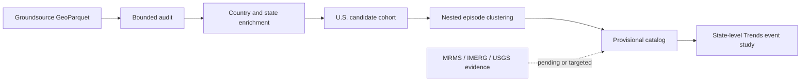

# GeoDemand-FF

GeoDemand-FF is a reproducible geospatial event-study pipeline for constructing
candidate U.S. flood episodes and measuring state-level search-interest responses
around them. It provides deterministic data auditing, spatial enrichment, episode
clustering, evidence provenance, and non-causal Google Trends event-study tools. It
does not yet provide predictive forecasting or confirmed flood ground truth.

## Research Questions

- Can a large global flood-footprint archive support a reproducible U.S. candidate-event cohort?
- Which clustering assumptions materially change candidate episode membership?
- Do state-level search-interest series show stable, event-associated responses around candidates?
- How much can precipitation and nearby-gauge evidence strengthen later episode review?

## Pipeline



## Verified Results

| Result | Verified value |
|---|---:|
| Groundsource records audited | 2,646,302 |
| Eligible U.S. candidate records, 2022-2025 | 88,515 |
| Provisional conservative episodes | 37,053 |
| Duplicate episode memberships | 0 |
| Cross-split membership leakage | 0 |
| Offline tests | 140 collected: 138 passed, 2 opt-in skipped |

The Groundsource audit had balanced row accounting, no rejected or quarantined rows,
and 300 antimeridian-review flags. These records and clusters remain candidates, not
confirmed urban flash floods.

## Implementation Status

| Component | Status |
|---|---|
| Groundsource GeoParquet audit | Complete for the confirmed 2026 local file |
| Country and U.S. state enrichment | Implemented and full-data run completed |
| Candidate cohort and episode clustering | Implemented; deterministic full-data outputs verified |
| Provisional catalog | Implemented; physical support remains pending |
| MRMS | Inventory/fetch scaffold implemented; real episode extraction pending |
| NASA IMERG | Inventory/fetch scaffold implemented; real episode extraction pending |
| USGS | Configured nearby-gauge response workflow; not proof of hydrologic connectivity |
| Google Trends | Manual-export and non-causal event-study workflow implemented; real evidence pilot pending |
| Forecasting models | Not implemented |

## Five-Minute Synthetic Quickstart

The demo uses only clearly labeled synthetic fixtures. It runs candidate clustering,
builds a provisional catalog, computes repeat-aware Trends phase metrics, and writes a
real deterministic SVG plot.

PowerShell:

```powershell
uv venv
uv pip install -e ".[dev]"
uv run python scripts/synthetic_demo.py --output-dir demo-output
uv run python scripts/validate_documented_cli.py
uv run python scripts/run_tests.py
```

POSIX shell:

```bash
uv venv
uv pip install -e '.[dev]'
uv run python scripts/synthetic_demo.py --output-dir demo-output
uv run python scripts/validate_documented_cli.py
uv run python scripts/run_tests.py
```

Source-specific network and native clients are optional: `mrms`, `imerg`, `usgs`,
`trends-browser`, and the combined `verification` extra. Ordinary tests do not make
live external-service requests.

## Key Engineering Features

- Bounded row-group and batch processing for multimillion-row GeoParquet audits.
- Deterministic identifiers, manifests, scientific summaries, and clustering comparisons.
- Versioned Arrow schemas and mandatory provenance for physical evidence.
- Explicit quarantine, rejection, duplicate, geometry, and row-accounting policies.
- Repeat-preserving Trends metrics with robust phase lifts and stability diagnostics.
- Metadata-backed control-state selection with transparent fallback labels.
- Portable test runtime and Python 3.11-3.13 CI.

## Scientific Limitations

Groundsource footprints are candidate observations, not validated flood ground truth.
Spatial assignment inherits boundary-resolution uncertainty. Episode connectivity is
sensitive to temporal and spatial policy choices. Nearby USGS response is geographic
context, not proof that a gauge drains an event footprint. Google Trends indices are
request-relative and event-study classifications are non-causal. Real MRMS and IMERG
episode extraction and the real Google Trends evidence pilot remain pending.

## Reproduction And Documentation

- [Reproduction commands](docs/reproduction.md)
- [Milestone record](docs/milestones.md)
- [Architecture](docs/architecture.md)
- [Data card](docs/data_card.md)
- [Groundsource audit](docs/groundsource_audit.md)
- [Episode catalog](docs/provisional_episode_catalog.md)
- [Google Trends feasibility](docs/google_trends_feasibility.md)
- [Data licenses and redistribution](DATA_LICENSES.md)

Create a source-only public archive from a clean commit with:

```bash
git archive --format=zip --output GeoDemand-source.zip HEAD
```

## Citation And License

Citation metadata are in [CITATION.cff](CITATION.cff). Code is available under the
[MIT License](LICENSE). External data retain their own terms and are not included.
