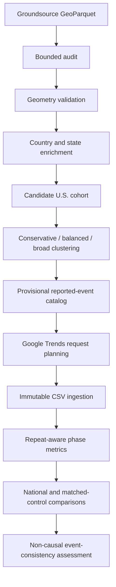

# Architecture

GeoDemand-FF is a reproducible geospatial event-study pipeline for constructing
candidate U.S. flood episodes from reported flood footprints and evaluating
state-level search-interest responses before and after those episodes.

## Active Pipeline

## Design Decisions

The package uses a `src/` layout so tests import the installed package rather than
accidentally importing files from the repository root.

`pyproject.toml` is the single dependency and tool configuration file. Optional browser
automation dependencies are isolated in the `trends-browser` extra so ordinary offline
tests do not install browser tooling.

Groundsource ingestion uses bounded Parquet row-group and batch processing. Smoke limits
are applied before downstream audit metrics so development runs measure the same bounded
row population across schema, geometry, duplicate, temporal, and geographic summaries.

Geometry is decoded from WKB and preserved as WKB. Representative coordinates use
`representative_point()` rather than centroids so points remain inside Polygon and
MultiPolygon footprints where possible. Invalid decodable geometries are quarantined by
default instead of repaired automatically.

Country assignment uses Natural Earth boundaries, and U.S. state assignment uses Census
state/equivalent geometries. Natural Earth remains useful for international country
context; state-union denominators are used for U.S. state coverage checks to avoid
boundary-resolution mismatches.

Episode clustering keeps conservative, balanced, and broad policies separate. The
provisional catalog is based on conservative membership, clustering sensitivity,
spatial/temporal diagnostics, episode size, compactness, manual-review rules, deterministic
decision history, and split/merge candidates derived from clustering evidence.

Google Trends ingestion treats official CSV exports as immutable inputs. Sidecars provide
request lineage, export attempt metadata, terminology versions, and repeat IDs. Phase
metrics are calculated within a request series; the workflow does not subtract raw
0-to-100 values across geographies.

Repeat-aware concurrence aggregation is deterministic and separates scientific result
metrics from volatile execution metadata. National and matched-control comparisons are
used as observational diagnostics, not causal labels.

## Determinism

JSON outputs use stable key ordering and formatting. Scientific summaries exclude volatile
fields such as timestamps, elapsed seconds, throughput, output directories, and run IDs.
Synthetic demonstrations record canonical content hashes for table outputs.

## Limits

Candidate episodes are reported-event research units. They may include duplicate reports,
spatially broad footprints, boundary artifacts, or reports whose timing differs from local
search behavior. Google Trends values are relative indices and depend on request terms,
geography, sampling, and export timing.
