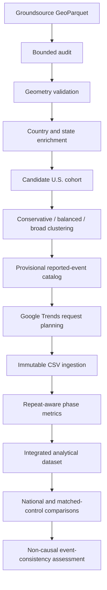

# Architecture

GeoDemand-FF is a reproducible geospatial event-study pipeline for constructing
candidate U.S. flood episodes from reported flood footprints and evaluating
state-level search-interest responses before and after those episodes.

## Active Pipeline

## Design Decisions

The package uses a `src/` layout so tests import the installed package rather than
accidentally importing files from the repository root.

`pyproject.toml` is the single dependency and tool configuration file. Optional browser
automation dependencies are isolated in the `trends-browser` extra so ordinary offline
tests do not install browser tooling.

Groundsource ingestion uses bounded Parquet row-group and batch processing. Smoke limits
are applied before downstream audit metrics so development runs measure the same bounded
row population across schema, geometry, duplicate, temporal, and geographic summaries.

Geometry is decoded from WKB and preserved as WKB. Representative coordinates use
`representative_point()` rather than centroids so points remain inside Polygon and
MultiPolygon footprints where possible. Invalid decodable geometries are quarantined by
default instead of repaired automatically.

Country assignment uses Natural Earth boundaries, and U.S. state assignment uses Census
state/equivalent geometries. Natural Earth remains useful for international country
context; state-union denominators are used for U.S. state coverage checks to avoid
boundary-resolution mismatches.

Episode clustering keeps conservative, balanced, and broad policies separate. The
provisional catalog is based on conservative membership, clustering sensitivity,
spatial/temporal diagnostics, episode size, compactness, manual-review rules, deterministic
decision history, and split/merge candidates derived from clustering evidence.

Google Trends ingestion treats official CSV exports as immutable inputs. Sidecars provide
request lineage, export attempt metadata, terminology versions, and repeat IDs. Phase
metrics are calculated within a request series; the workflow does not subtract raw
0-to-100 values across geographies.

Repeat-aware concurrence aggregation is deterministic and separates scientific result
metrics from volatile execution metadata. National and matched-control comparisons are
used as observational diagnostics, not causal labels.

The Milestone 1.0A analysis dataset is an integration artifact, not a modeling stage. It
uses `request_id`, `repeat_id`, and `concept_id` as the analytical row grain. Request
plans are read through the shared CSV/Parquet request-plan reader, while episode-response
metrics join by `request_id` and `concept_id`, and repeat/phase metrics join by the full
grain. Duplicate normalized keys are rejected before writing outputs; unmatched joins are
reported in both directions in deterministic summary artifacts. Empty normalized keys,
unplanned concepts, ambiguous mixtures of request-level fallback plans and repeat-specific
plans, and conflicts in joined lineage or event windows are rejected. The integrated table
also retains treated geography, concept semantics, proxy type, export attempt, standardized
peak lift, peak timing, and phase valid-day counts needed by downstream work. Milestone
1.0A remains an integration and validation boundary; it does not perform statistical
signal validation. Plan-side orphan checks operate per concept and repeat. An unambiguous
request-level fallback plan applies its concept set to every repeat present in phase or
repeat metrics for that request. Both the upstream phase table and integrated dataset use
formal Arrow schemas, so empty and populated artifacts have identical columns and types.

Milestone 1.0B adds a separate descriptive boundary through `analysis describe-signal`.
The command consumes the integrated 1.0A table without modifying it. Dataset-level output
uses explicitly selected response metrics after aggregating repeat values to one mean per
`request_id + concept_id`. Geography/concept, episode/concept, and semantic-family
summaries use those same equally weighted request/concept units. Raw-row, valid-repeat,
request/concept-unit, and independent-request counts remain explicit. Paired diagnostics
require exactly two repeats and exactly two finite values; requests with more repeats are
classified as multi-repeat rather than silently reduced to a pair. Rank agreement also
requires exactly two exports and identifies `request_id` as the repeated unit. Every
Parquet artifact has an
explicit Arrow schema, and excluded metrics, values, groups, and relative differences are
reported. This boundary is exploratory and contains no inferential procedures.

## Determinism

JSON outputs use stable key ordering and formatting. Scientific summaries exclude volatile
fields such as timestamps, elapsed seconds, throughput, output directories, and run IDs.
Synthetic demonstrations record canonical content hashes for table outputs.

## Limits

Candidate episodes are reported-event research units. They may include duplicate reports,
spatially broad footprints, boundary artifacts, or reports whose timing differs from local
search behavior. Google Trends values are relative indices and depend on request terms,
geography, sampling, and export timing.
